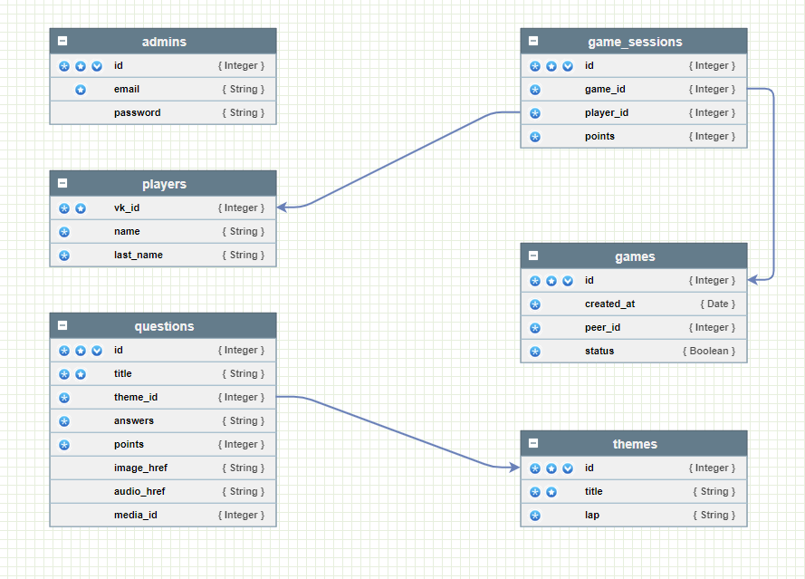

## Своя игра

Для локального использования сервиса:
1. Загрузить все файлы репозитория **my_game** \
    или выполнить команду в терминале bash ***"git clone https://github.com/RuslanLat/my_game"***
2. Порядок запуска сервиса:
* в директории с проектом в терминале выполнить команду ***docker-compose up -d --build*** (сборка контейнеров и запуск их в работе в фоновом режиме)
* для остановки работы сервера в директории с проектом в терминале выполнить команду ***docker-compose stop***
* для повторного запуска в директории с проектом в терминале выполнить команду ***docker-compose start*** 

***Примечание:*** в директории с проектом (my_game) создается папка ***pgdata*** с данными базы данных

## Механика:
* Бот перед началом игры показывает список всех возможных тем и вопросов для выбора.
* Бот рандомно выбирает пользователя, который будет ходить первым.
* Пользователь выбирает тему и баллы, которые будут начисленны в случае правильного ответа.
* Пользователь, который раньше остальных нажмет на кнопку "Ответить" - будет называть свой вариант ответа.
* В случае если ответ был верный, - пользователю будет начислены баллы и предоставлено право выбрать следующий вопрос. В случае неправильного ответа баллы будут списаны со счета игрока, и ход перейдет другому игроку.
* Игра идет до тех пор, пока не останется ни одного вопроса.

## Схема бота

[drawio](https://drive.google.com/file/d/1AZBOMmxkPKLCDmFOfuJSQOnLViNDJdic/view?usp=sharing)

## Модель данных

## Контакты

Руслан Латипов  @rus_lat116 